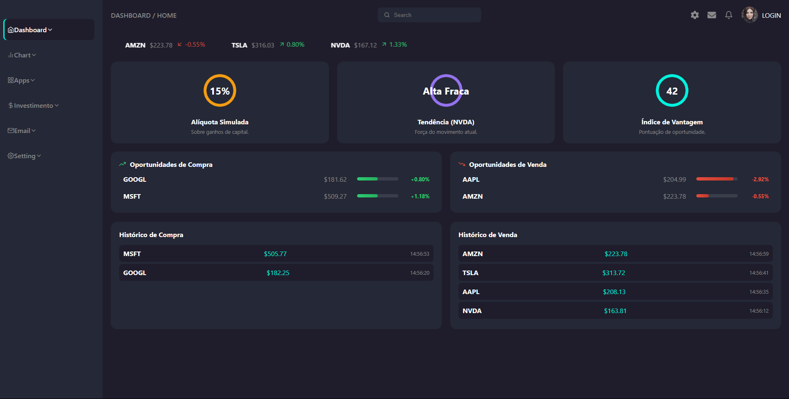

# 📈 Painel Financeiro Dinâmico

[](https://opensource.org/licenses/MIT)
[](https://github.com/cai0luan/Site-Bolsa-de-Valores)

<p align="center">
  Um painel de análise de mercado de ações interativo e responsivo, construído com React e Vite, que consome dados reais de uma API externa para fornecer simulações e visualizações dinâmicas.
</p>

<div align="center">

**Acesse a demonstração ao vivo clicando no botão abaixo:**

<a href="https://cai0luan.github.io/Site-Bolsa-de-Valores/" target="_blank">
  
</a>

</div>

<br>

### Visualização do Projeto
<p align="center">
  
</p>

---

## ✨ Funcionalidades Principais

*   **Dashboard Interativo:** Visualização em tempo real de dados de ações com widgets dinâmicos que se atualizam constantemente.
*   **Análise Técnica:** Página dedicada com gráficos de velas e volume, utilizando a biblioteca Lightweight Charts.
*   **Navegação Fluida:** Roteamento de página única (SPA) com animações de transição suaves entre as seções, implementado com React Router e Framer Motion.
*   **Consumo de API Externa:** Integração com a API da Financial Modeling Prep para buscar dados reais do mercado de ações.
*   **Simulador de Investimentos:** Uma ferramenta que analisa as melhores oportunidades de compra/venda e projeta o crescimento de um investimento com base em juros compostos.
*   **Design Responsivo:** A interface se adapta a diferentes tamanhos de tela, de desktops a dispositivos móveis.
*   **Componentização:** O código é organizado em componentes reutilizáveis e páginas, seguindo as melhores práticas do React.

## 🛠️ Tecnologias Utilizadas

- **React:** Biblioteca principal para a construção da interface.
- **Vite:** Ferramenta de build extremamente rápida para o ambiente de desenvolvimento.
- **React Router:** Para o gerenciamento das rotas e navegação.
- **Framer Motion:** Para as animações de página e interações.
- **Recharts / Lightweight Charts:** Para a criação de gráficos financeiros interativos.
- **React Icons:** Para a utilização de ícones em toda a aplicação.
- **CSS3:** Para a estilização, utilizando variáveis para um design consistente.

## 🚀 Rodando o Projeto Localmente

Para rodar este projeto em sua máquina, siga os passos abaixo:

1. **Clone o repositório:**
   ```bash
   git clone https://github.com/cai0luan/Site-Bolsa-de-Valores.git
